# WebAuthn Authentication Flow - Mermaid Diagram

## Interactive Sequence Diagram

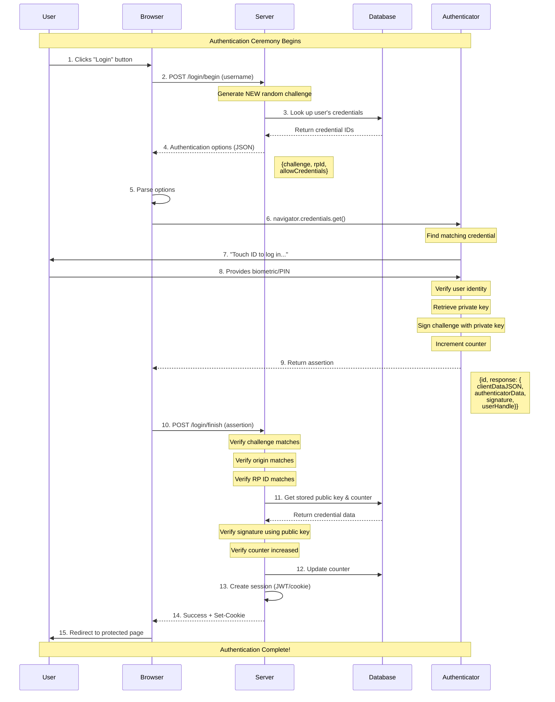

## Key Steps Explained

### Steps 1-4: Authentication Initiation
- User wants to log in (may enter username)
- Server generates a FRESH, unique challenge
- Server looks up which credentials belong to this user
- Server sends authentication options with `allowCredentials`

### Steps 5-8: User Verification
- Browser invokes WebAuthn API with options
- Authenticator finds the matching credential
- User proves identity (biometric/PIN)
- Authenticator retrieves the private key (never leaves device!)

### Steps 9-10: Signature Creation
- Authenticator signs the challenge with private key
- Counter is incremented (detect cloned credentials)
- Browser sends the assertion to server

### Steps 11-15: Server Verification & Session Creation
- Server verifies challenge, origin, and RP ID
- Server verifies signature using stored public key
- Server checks counter increased (security check)
- Server creates session
- User is logged in!

## Authentication vs Registration

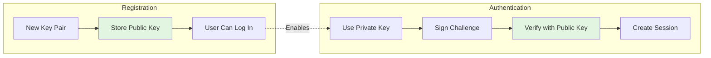

## Signature Verification Process

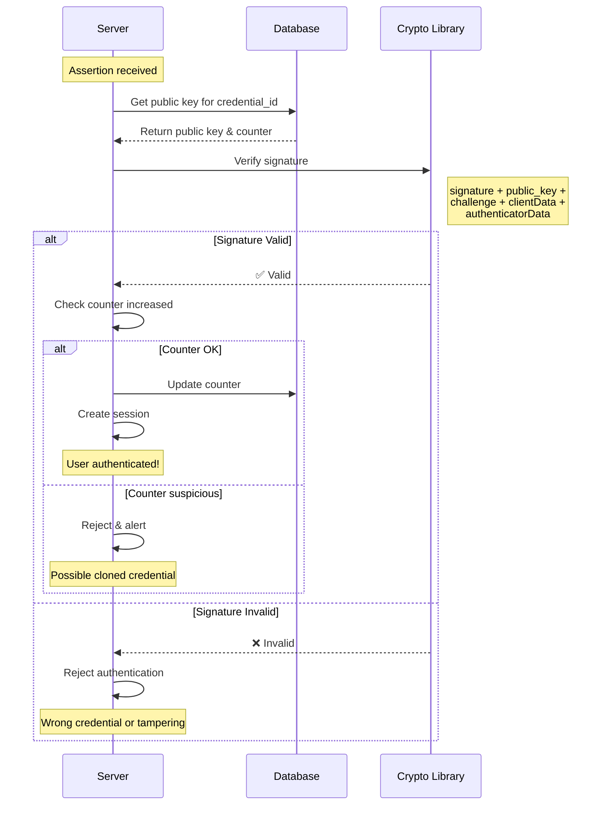

## Two Login Patterns

### Pattern 1: Username-First Flow

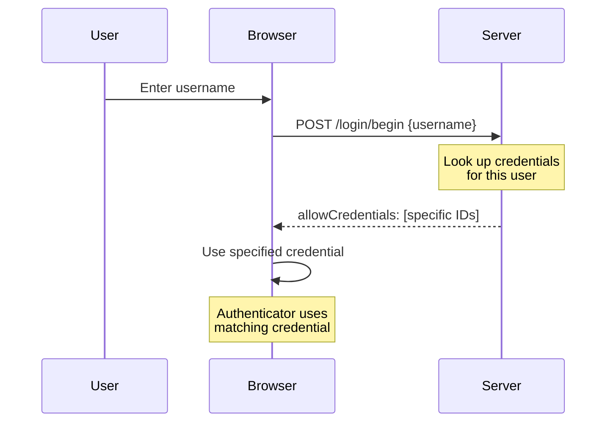

### Pattern 2: Discoverable Credentials (Usernameless)

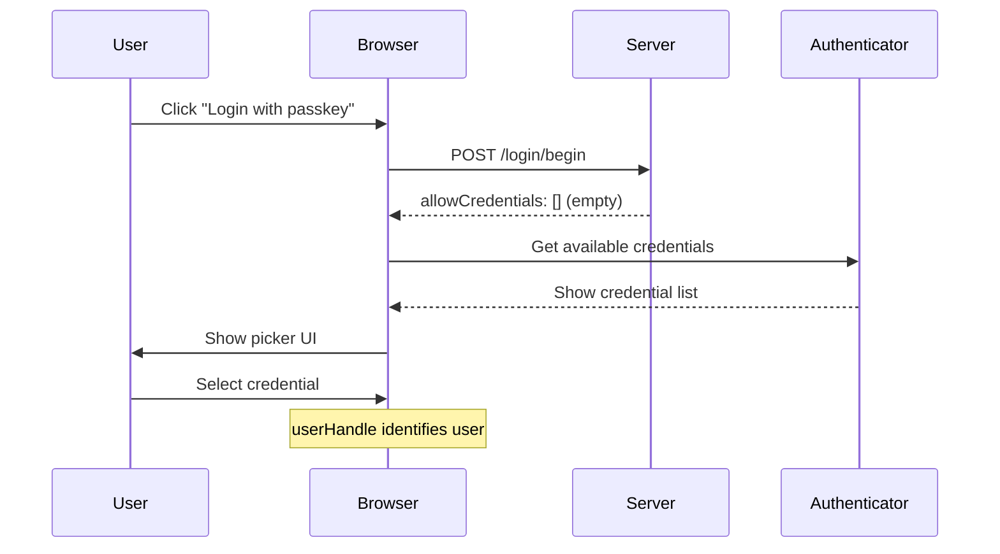

## Security Verification Flowchart

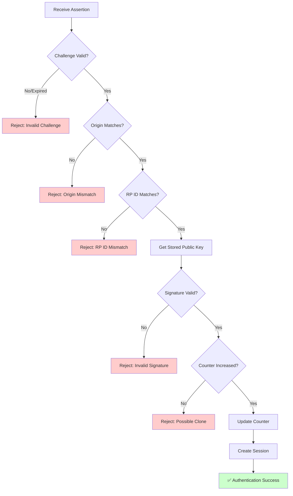

## What Gets Verified

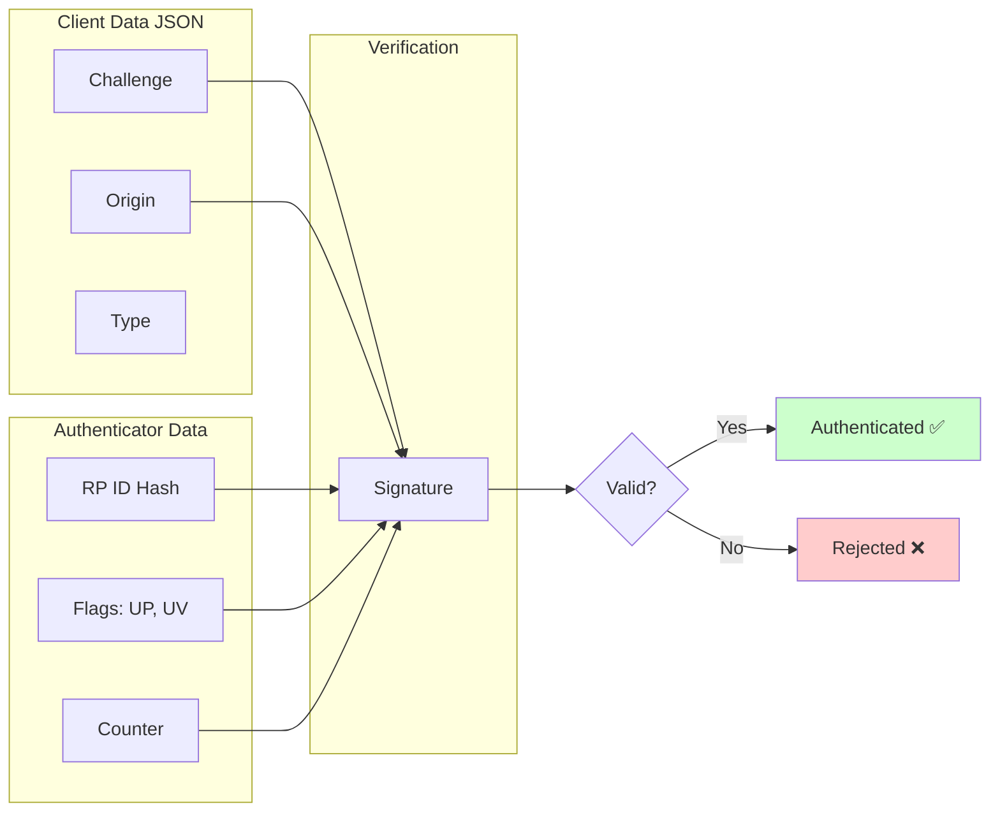

## Phishing Protection Visualization

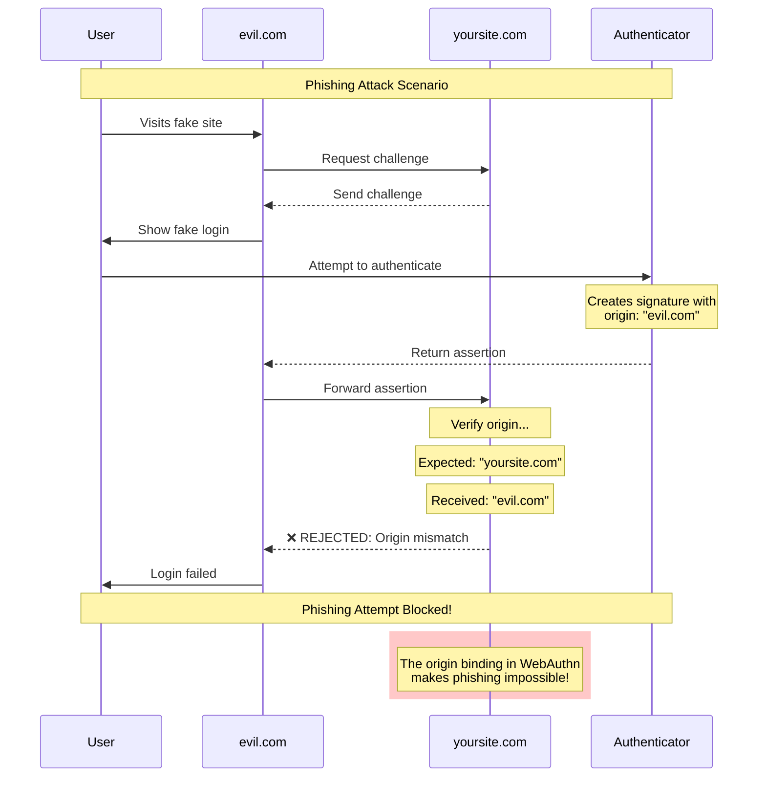

## Session Management

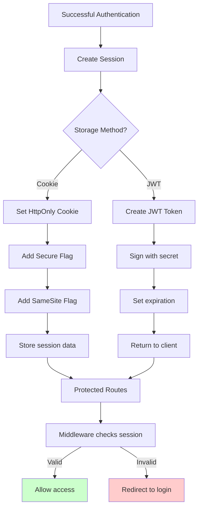

## Counter Tracking (Clone Detection)

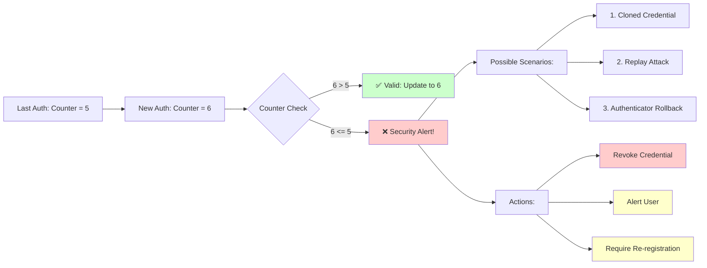

## Complete Authentication State Machine

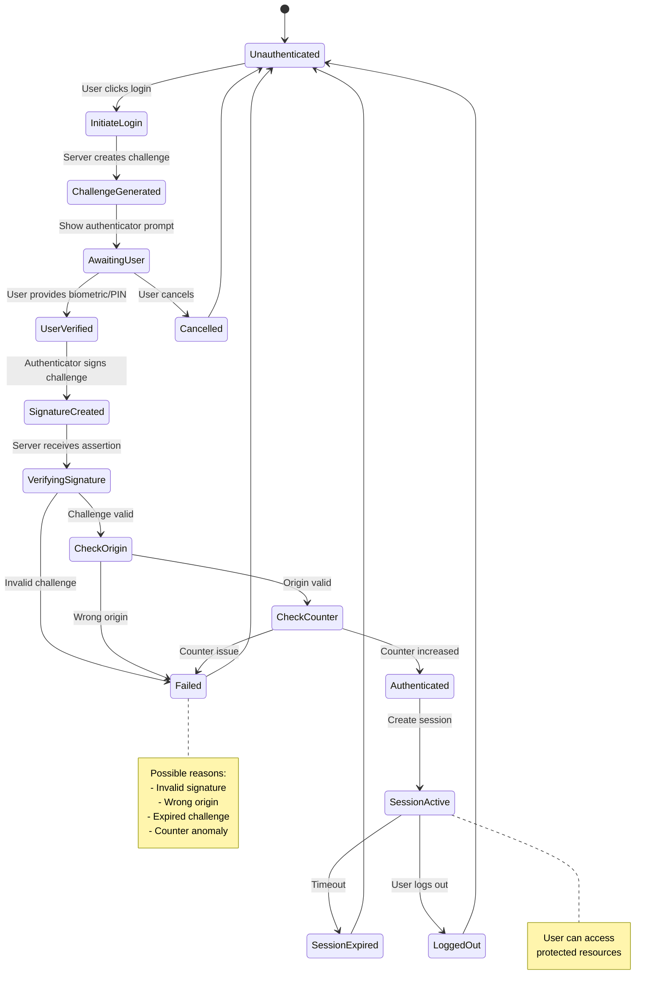

## Password vs Passkey Comparison

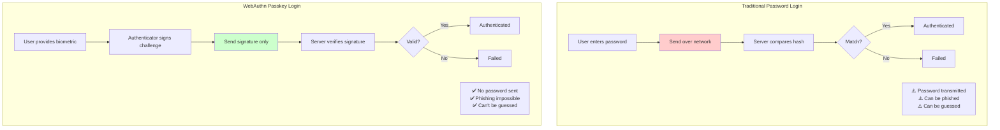

## Troubleshooting Common Issues

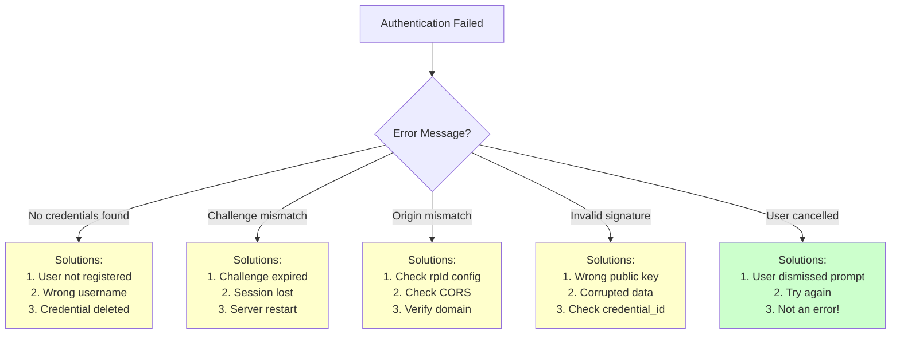

## How to View These Diagrams

### Recommended: VS Code Extension

1. **Install extension:**
   - Open VS Code
   - Go to Extensions (Cmd+Shift+X)
   - Search for "Markdown Preview Mermaid Support"
   - Install it

2. **View the diagram:**
   - Open this file in VS Code
   - Press `Cmd+Shift+V` (Mac) or `Ctrl+Shift+V` (Windows/Linux)
   - See beautiful rendered diagrams!

### Alternative: Online Viewer

1. Go to https://mermaid.live
2. Copy any mermaid code block from this file
3. Paste into the editor
4. View interactive diagram
5. Export as PNG/SVG if desired

### Alternative: GitHub

1. Push this file to a GitHub repository
2. View on GitHub (automatic Mermaid rendering)

## Next Steps

Now that you understand authentication:

1. ✅ Understand registration flow
2. ✅ Understand authentication flow
3. ⬜ Design database schema
4. ⬜ Implement backend endpoints
5. ⬜ Build frontend components
6. ⬜ Test the complete flow

Ready to start implementing? Let me know!
