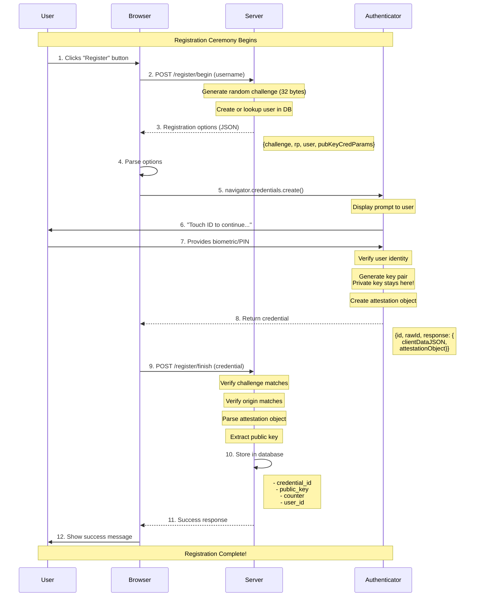
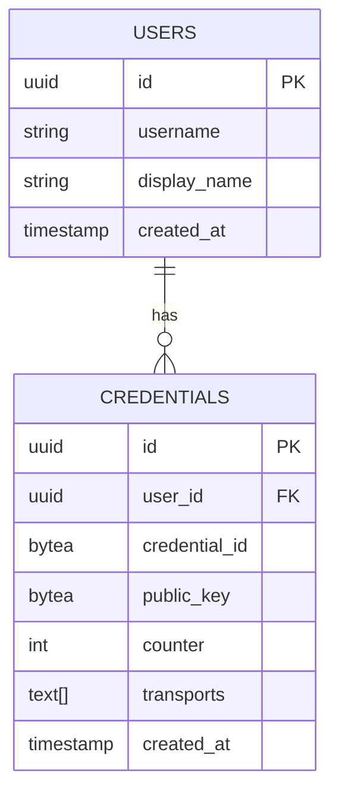
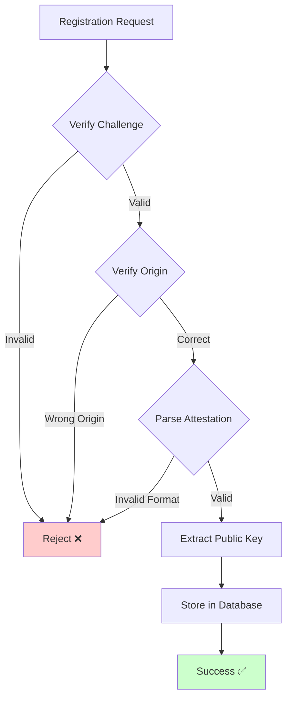
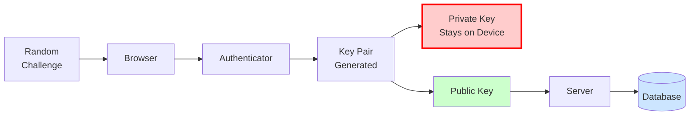
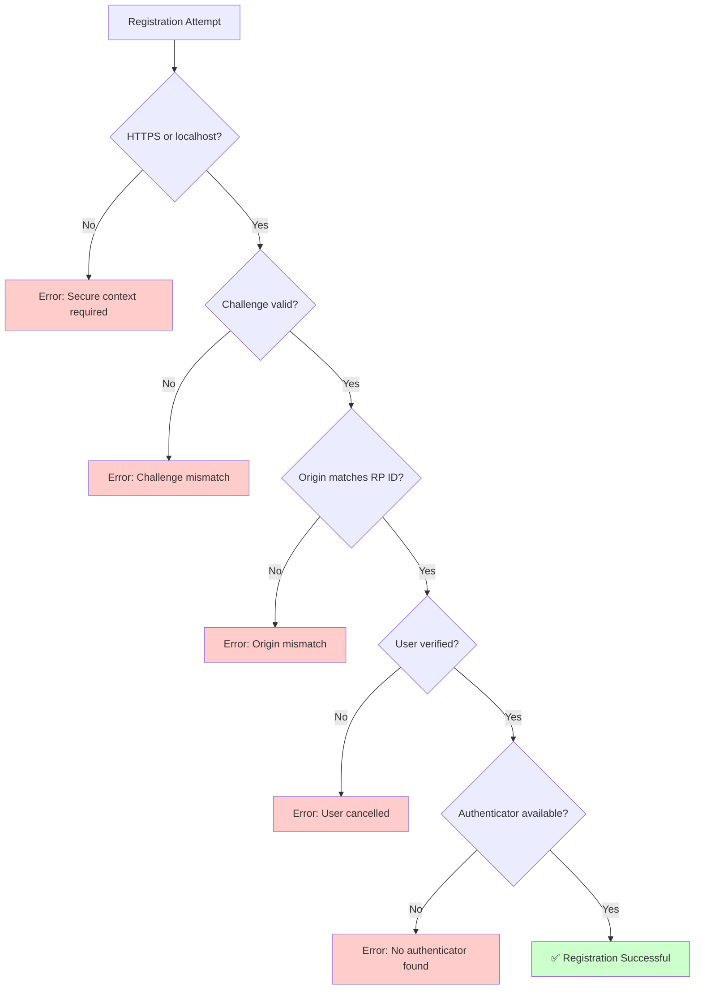

# WebAuthn Registration Flow - Mermaid Diagram

## Interactive Sequence Diagram

## Key Steps Explained

### Steps 1-3: Initiation
- User wants to create an account
- Server generates a unique, random challenge
- Server sends registration options to browser

### Steps 4-7: User Verification
- Browser invokes WebAuthn API
- Authenticator prompts user (Touch ID, Face ID, PIN, etc.)
- User proves their identity

### Steps 8-9: Credential Creation
- Authenticator generates a brand new key pair
- **Private key NEVER leaves the authenticator**
- Public key is packaged with other data
- Browser sends credential to server

### Steps 10-12: Server Processing
- Server verifies the challenge (prevent replay attacks)
- Server verifies the origin (prevent phishing)
- Server extracts and stores the public key
- User is now registered!

## What Gets Stored

## Security Highlights

## Data Flow Visualization

## Common Errors During Registration

## How to View This Diagram

### Option 1: VS Code
1. Install extension: "Markdown Preview Mermaid Support"
2. Open this file
3. Press `Cmd+Shift+V` (Mac) or `Ctrl+Shift+V` (Windows/Linux)
4. See beautiful rendered diagrams!

### Option 2: GitHub
1. Push this file to GitHub
2. GitHub automatically renders Mermaid diagrams
3. View in browser

### Option 3: Online
1. Copy the mermaid code blocks
2. Go to https://mermaid.live
3. Paste and view/edit interactively
4. Export as PNG/SVG if desired

### Option 4: Obsidian
1. Open this file in Obsidian
2. Mermaid diagrams render automatically
3. Great for note-taking while learning!

## Next Steps

After understanding registration:
1. Read the authentication flow diagram
2. Understand how the stored public key is used
3. See how sessions are created after successful auth
4. Start implementing the backend!
